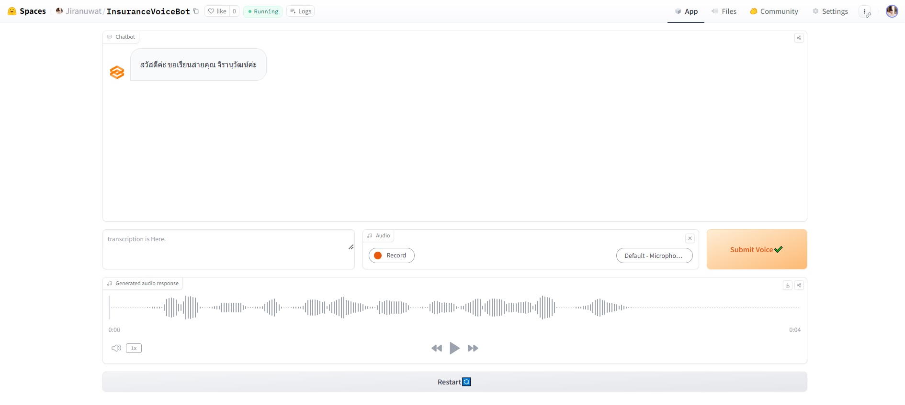

# Insurance Voicebot

**During my internship at I&I Group Public Company Limited (IIG) in Chiang Mai**, I was involved in this project. This speak-able AI project aims to replace human call centers for selling insurance property. We developed a voice bot leveraging Text-to-Speech (TTS), Natural Language Processing (NLP), and Automatic Speech Recognition (ASR) technologies.

## Huggingface🤗
https://huggingface.co/spaces/Jiranuwat/InsuranceVoiceBot

## Usage

To try this demo follow these steps.

- From Audio block, click Record button and speak something to the bot.
- When finished recording, click Stop button.
- Click Submit Voice✔️ button.
- Wait until bot generate text and audio response.
- From Generated audio response block, click play button to play bot's audio response.
- Continue these steps until you want to restart.